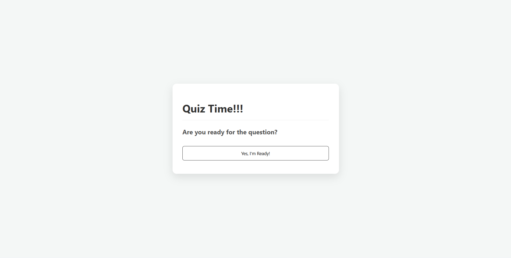

# Project 1 - Quiz App

A simple and interactive Quiz Application built using HTML, CSS, and JavaScript.  
This project allows users to answer multiple-choice questions one at a time and receive a final score at the end.

---

## 📸 Preview

  

---

## 📌 Features

- ❓ Multiple-choice questions  
- 👉 Display one question at a time  
- ⏭ Next button to navigate between questions  
- ✅ Submit button to finish the quiz  
- 🏆 Final score display  
- 🔄 Restart quiz option  
- ✨ Smooth transitions between questions  
- 📱 Responsive design (mobile & desktop friendly)  

---

## ⚙️ How It Works

- The quiz displays one question at a time.
- Users select one answer from multiple choices.
- Clicking **Next** moves to the next question.
- Clicking **Submit** on the last question shows:
  - Final score
  - Total correct answers
  - Restart option
- The score is tracked dynamically using JavaScript.

---

## 🛠 Tech Stack

- HTML  
- CSS  
- JavaScript  

---

## 👩‍💻 Author

Created by **Ummu Husnul**
